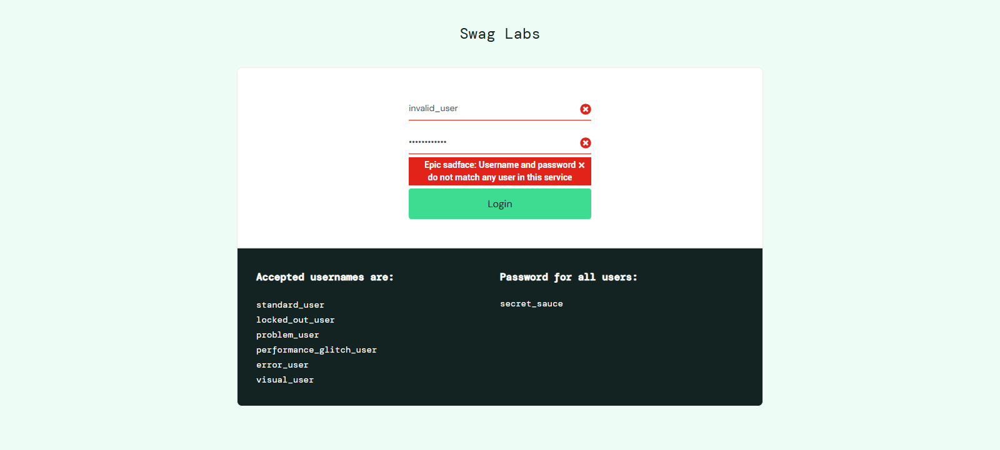

<p align="center">
  <a href="https://www.linkedin.com/in/matias-damian-nazadek/"></a>
  <a href="https://www.python.org/"></a>
<a href="https://www.selenium.dev/"></a>
<a href="https://docs.pytest.org/en/stable/"></a>
</a>
</p>

<div align="center">
    <a href="https://www.selenium.dev/"></a>
</div>

# E2E Testing con Selenium - SauceDemo

## Sobre el proyecto

En este repositorio hay ejemplos de **pruebas automatizadas E2E** usando **Selenium** y **Pytest** sobre la app [SauceDemo](https://www.saucedemo.com/).  
Se implementa **Page Object Model** y captura de **screenshots automáticamente** cuando un test falla.
Además, el proyecto soporta ejecución **cross-browser** (Chrome y Firefox) y genera **reportes HTML** con timestamp para cada uno.

### Estructura del proyecto
```
e2e-testing-selenium/
├── pages/                   # Clases Page Object
│   ├── cart_page.py         # Métodos para interactuar con el carrito de compras
│   ├── checkout_page.py     # Métodos para completar el proceso de checkout
│   ├── login_page.py        # Métodos para interactuar con la pantalla de login
│   ├── product_page.py      # Métodos para ver productos, agregarlos al carrito y filtrarlos
├── tests/                   # Tests automatizados
│   ├── conftest.py          # Fixtures compartidos, setup/teardown de Selenium (multi-navegador)
│   ├── test_cart.py         # Tests relacionados con agregar/remover productos del carrito
│   ├── test_checkout.py     # Tests del flujo de checkout, pagos y confirmación
│   ├── test_login.py        # Test login exitoso
│   └── test_login_fail.py   # Test login fallido y manejo de errores
├── reports/                 # Se genera automáticamente al ejecutar los tests para Reportes HTML
│   ├── screenshots/         # Capturas de pantalla al fallar un test
├── requirements.txt         # Dependencias del proyecto
└── run_tests.py             # Script para ejecutar todos los tests cross-browser
└── pytest.ini               # Configuración de Pytest
```

### Requisitos:

- Python 3.13
- Selenium
- Pytest
- Webdriver Manager
- Pytest HTML (para reportes)

### Instalación de dependencias

Clonamos el repositorio:

```bash
git clone https://github.com/matiasdn91/e2e-testing-selenium.git
cd e2e-testing-selenium
```
Levantamos el entorno virtual:
```bash
# Linux/Mac
python -m venv .venv
source .venv/bin/activate

# Windows
python -m venv .venv
.venv\Scripts\activate
```
Instalamos las dependencias:
```
pip install -r requirements.txt
```
### Cómo ejecutar los tests:

- Con el script *run_tests.py* (Chrome por defecto)

Ejecuta todos los tests y genera reportes HTML con timestamp y screenshots diferenciados por browser:
```
python run_tests.py
python run_tests.py chrome
python run_tests.py firefox
python run_tests.py all
```
- O manualmente con PyTest, para generar un único reporte HTML sobrescribiendo el reporte existente:
```
pytest -v --html=reports/report.html --self-contained-html
```
### Capturas de pantalla automáticas:

Si un test falla, se genera un screenshot automáticamente incluyendo timestamp en:

>*reports/screenshots/test_fail.png*

Ejemplo:
<p align="center">
  
</p>

## Tests y métricas de calidad

### Instalar cobertura:
```
pip install pytest-cov
```
### Correr todos los tests y ver cobertura en consola:
```
pytest --cov=pages --cov-report=term-missing
```
### Generar reporte HTML de cobertura:
```
pytest --cov=pages --cov-report=html
```
### Notas:

- Los reportes HTML están ignorados en GitHub (reports/) para mantener el repositorio limpio.
- Los fixtures de Selenium se encuentran en conftest.py.
- Implementamos Page Object Model para separar la lógica de interacción con la UI.
- Se utiliza pytest-cov para medir la cobertura de código de los Page Objects y tests.